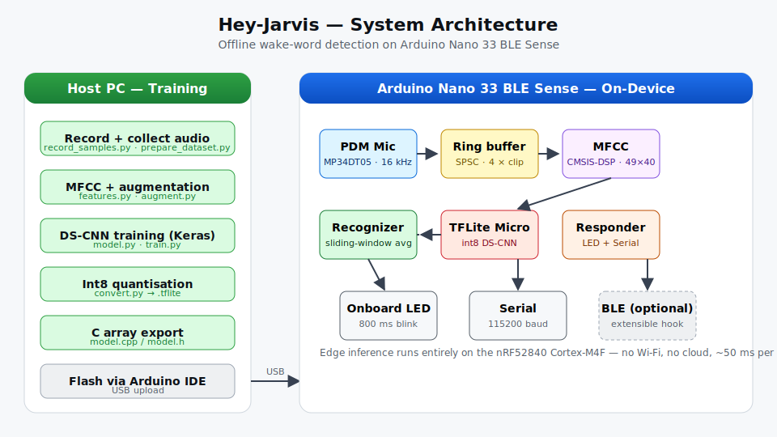
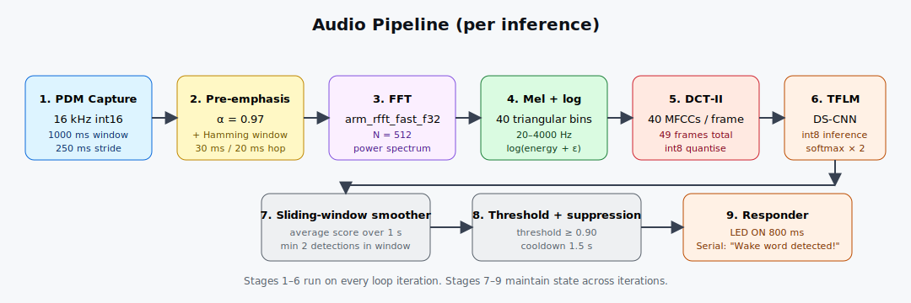

# Hey-Jarvis — On-Device Wake Word Detection

An offline, always-listening wake-word detector for the **Arduino Nano 33 BLE Sense**.
The device continuously samples its onboard PDM microphone, extracts MFCC features,
runs a quantised Depthwise-Separable CNN on TensorFlow Lite Micro, and lights the
onboard LED + prints a structured Serial message whenever it hears **"Hey Jarvis."**

No cloud. No Wi-Fi. ~25 KB of flash. < 50 ms inference.

---

## Project layout

```
wake word detection/
├── README.md
├── docs/
│   ├── architecture.svg          System-level block diagram
│   ├── pipeline.svg              Audio → feature → inference pipeline
│   └── DATASET.md                Guide for collecting and curating data
├── python/                       Training & conversion (TF 2.16)
│   ├── config.py                 Single source of truth for all constants
│   ├── audio_utils.py            WAV I/O, resampling, normalization
│   ├── features.py               MFCC extraction (librosa)
│   ├── augment.py                Time-shift, gain, additive-noise augmentation
│   ├── prepare_dataset.py        Downloads Speech Commands, builds dirs
│   ├── record_samples.py         Interactive recorder for positives
│   ├── dataset.py                tf.data pipeline
│   ├── model.py                  DS-CNN architecture
│   ├── train.py                  Training script
│   ├── evaluate.py               Metrics + confusion matrix
│   ├── convert.py                Keras → int8 TFLite → C array
│   ├── requirements.txt
│   └── tests/                    Pytest unit tests
├── arduino/HeyJarvisWakeWord/    Embedded firmware (C++17, mbed core)
│   ├── HeyJarvisWakeWord.ino     Top-level Arduino sketch
│   ├── config.h                  Shared constants (mirrors python/config.py)
│   ├── audio_provider.{h,cpp}    PDM ISR → ring buffer
│   ├── feature_provider.{h,cpp}  CMSIS-DSP MFCC extractor
│   ├── recognize_commands.{h,cpp}  Sliding-window decision logic
│   ├── command_responder.{h,cpp} LED + Serial trigger
│   ├── ring_buffer.h
│   └── model.{h,cpp}             Generated by python/convert.py
└── scripts/
    └── tflite_to_c_array.py      Stand-alone .tflite → .cpp helper
```

---

## Quick start

### 1. Train (host PC)

```bash
cd python
python -m venv .venv && source .venv/bin/activate   # Windows: .venv\Scripts\activate
pip install -r requirements.txt

# Pull the Google Speech Commands dataset into data/raw/negative + background_noise/
python prepare_dataset.py --speech-commands

# Record at least 50–100 of your own "Hey Jarvis" clips
python record_samples.py --count 80 --speaker priya

# Train the DS-CNN
python train.py

# Inspect held-out metrics + confusion matrix
python evaluate.py

# Quantise to int8 and emit arduino/HeyJarvisWakeWord/model.cpp
python convert.py
```

### 2. Flash (Arduino IDE)

1. Install the **Arduino Mbed OS Nano Boards** core (Tools → Boards Manager).
2. Install libraries — **Arduino_TensorFlowLite** and ensure CMSIS-DSP is available
   (it ships with the mbed core).
3. Open `arduino/HeyJarvisWakeWord/HeyJarvisWakeWord.ino`.
4. Board: *Arduino Nano 33 BLE*. Port: your USB serial.
5. Upload, then open Serial Monitor at **115200 baud**.

### 3. Trigger

Say **"Hey Jarvis"** within ~20 cm of the board.  You should see:

```
Wake word detected!
Confidence: 96%
Total detections: 1
Uptime (ms): 8432
--------------------
```

…and the onboard LED lights for 800 ms.

---

## System architecture



Audio is captured at 16 kHz by the onboard MP34DT05 PDM mic and pushed by the
PDM ISR into a 4-second lock-light single-producer / single-consumer ring buffer.
The main loop:

1. Pulls a 1-second window (with 250 ms overlap) out of the ring.
2. Pre-emphasises the signal (α = 0.97), applies a Hamming window, computes a
   real FFT (CMSIS-DSP `arm_rfft_fast_f32`), accumulates a 40-bin mel filterbank,
   logs and runs a DCT-II to obtain **49 frames × 40 MFCCs**.
3. Quantises the float MFCCs to int8 using the TFLite model's input
   `scale` / `zero_point` and copies them into the input tensor.
4. Invokes the TFLite Micro interpreter.
5. De-quantises the positive-class output into a 0–255 score.
6. Smooths the score across a 1-second sliding window. If the average exceeds the
   threshold (default 0.90) for at least 2 frames and no detection has fired in
   the last 1.5 seconds, a wake-word event is dispatched to the LED/Serial
   responder.



---

## Model

A small **Depthwise-Separable CNN** inspired by Howard et al. (2017) and the
Google "DS-CNN small" topology from Zhang et al. (2017) — well-known to fit on
sub-megabyte microcontrollers.

```
Input         (49, 40, 1)
Stem conv     10×4 stride 2, 64 ch  → BN → ReLU
DS block × 4  3×3 depthwise → BN → ReLU → 1×1 pointwise → BN → ReLU
Global avg pool
Dropout 0.2
Dense softmax  (2)
```

Trainable parameters: ~46 k.  Post-training int8 quantisation typically yields a
~25 KB `.tflite`.  Runtime arena: 60 KB.

---

## Configuration knobs

| Where                         | What                                  | Default |
|-------------------------------|---------------------------------------|---------|
| `python/config.py`            | sample rate, MFCC layout, splits      | 16 kHz / 49 × 40 |
| `python/config.py` (`TRAIN`)  | epochs, LR, augmentation              | 40 epochs |
| `arduino/.../config.h`        | tensor arena, detection threshold     | 60 KB / 0.90 |
| `arduino/.../config.h`        | suppression / averaging windows       | 1.5 s / 1 s |

The Python and Arduino configs must stay in sync — anything that affects the
feature shape (sample rate, n_mfcc, n_frames) lives in **both** files.

---

## Phase checklist

| Phase | Status | File(s) |
|-------|--------|---------|
| 1. Hardware setup           | ✅ | `arduino/HeyJarvisWakeWord/audio_provider.{h,cpp}` |
| 2. Dataset collection       | ✅ | `python/prepare_dataset.py`, `python/record_samples.py` |
| 3. Preprocessing            | ✅ | `python/features.py`, `python/augment.py` |
| 4. Model training           | ✅ | `python/model.py`, `python/train.py` |
| 5. Embedded deployment      | ✅ | `python/convert.py`, `arduino/.../model.{h,cpp}` |
| 6. Real-time detection      | ✅ | `arduino/.../HeyJarvisWakeWord.ino` |
| 7. Action triggering        | ✅ | `arduino/.../command_responder.{h,cpp}` |
| 8. Optimisation             | ✅ | int8 quantisation, sliding-window suppression, CMSIS-DSP FFT |

---

## Tests

```bash
cd python
pytest -q
```

Tests cover:

* MFCC extractor — output shape, dtype, determinism.
* DS-CNN model — input/output shape, forward pass.
* `RingBuffer` semantics (via the Python reference — Arduino is verified via
  hardware integration).

---

## Tunable knobs you'll likely care about

* **`DETECTION_THRESHOLD`** (`config.h`) — raise to reduce false triggers, lower
  for noisy environments.
* **`kSuppressionMs`** — minimum gap between two consecutive detections.
* **PDM gain** — `PDM.setGain(value)` inside `audio_provider.cpp`. Default
  is `20` (board core sets it). Try `40` for quiet rooms.

---

## Assumptions

* Arduino Nano 33 BLE **Sense** (rev 1 or rev 2). Vanilla Nano 33 BLE does **not**
  have an onboard mic.
* Python 3.10 – 3.12, TensorFlow 2.16 (CPU is fine — training takes ~5 minutes on
  a laptop once Speech Commands is cached).
* The user records ≥ 50 positive samples for production-grade accuracy.
* CMSIS-DSP is provided by the mbed core that ships with the board package.

---

## Remaining nice-to-haves

These are intentionally left out of the default build to keep the firmware lean,
but the hooks are in place:

* **BLE notification** on detection — add a `BLEService` in
  `command_responder.cpp` and start advertising in `setup()`.
* **Streaming feature extraction** — currently MFCC runs after a full 1-second
  buffer is ready; a streaming variant would reduce latency by ~250 ms.
* **Hard-example mining** — log every false positive to flash and retrain.
